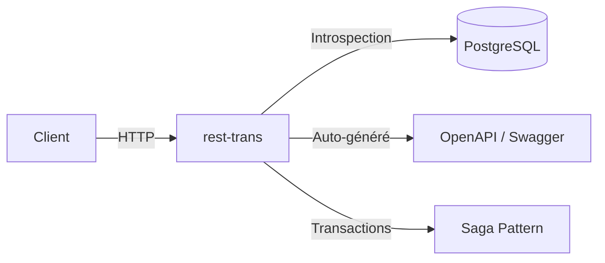
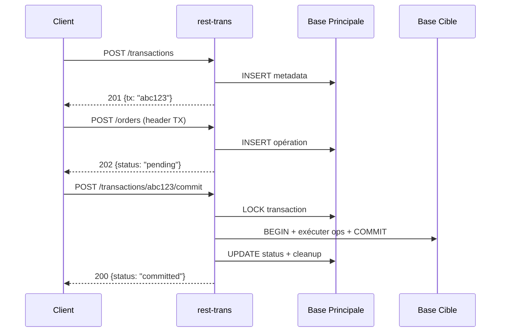
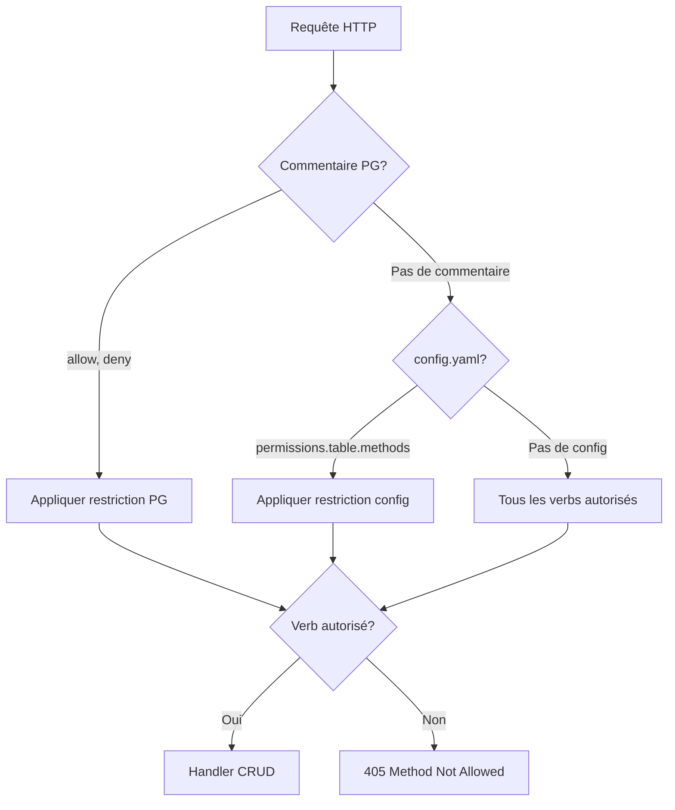
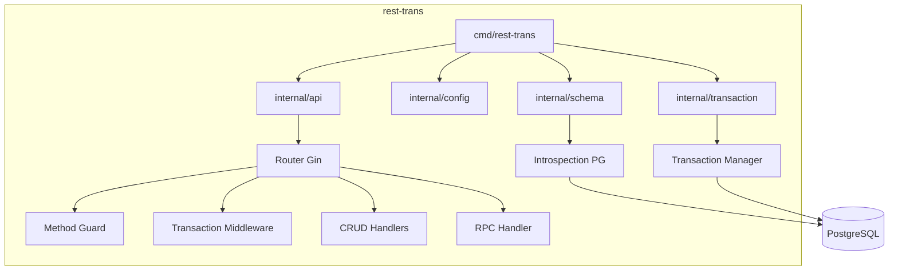

# rest-trans

Serveur REST API auto-généré à partir du schéma PostgreSQL. Expose automatiquement tables, vues et procédures stockées en tant qu'endpoints RESTful avec filtrage, pagination, embeddings de ressources, RPC et documentation OpenAPI.

Inspiré de [PostgREST](https://postgrest.org/), implémenté en Go avec Gin.



## Fonctionnalités

### Phase 1 — CRUD Core
- **Introspection automatique** : tables, vues, clés primaires, clés étrangères, contraintes uniques
- **Opérateurs de filtrage** : `eq`, `neq`, `gt`, `gte`, `lt`, `lte`, `like`, `ilike`, `in`, `is`, `match`, `imatch`, opérateurs JSONB (`cs`, `cd`, `ov`, `adj`, `sl`, `sr`, `nsr`, `nsl`)
- **Opérateurs logiques** : `_and`, `_or`, `_not.and`, `_not.or`
- **Sélection de colonnes** : `_select=col1,col2`
- **Tri** : `_order=col.desc,col2.asc`
- **Pagination** : `_limit`, `_offset` avec headers `Content-Range` et `Range`
- **Réponses JSON/CSV** via `Accept` header
- **CORS** configurable
- **Erreurs structurées** au format PostgREST

### Phase 2 — Fonctionnalités avancées
- **Documentation OpenAPI** : `GET /openapi.json` + Swagger UI sur `/swagger/` et `/docs`
- **Resource Embedding** : `_select=*,tasks(title,status)` avec LEFT JOINs automatiques
- **RPC / Fonctions stockées** : `POST /:schema/rpc/:function` avec introspection des paramètres
- **Upsert** : `Prefer: resolution=merge-duplicates` (ON CONFLICT DO UPDATE)
- **Bulk upsert** : `?on_conflict=col1,col2` pour cibler des colonnes spécifiques (pas juste la PK)
- **PUT singleton** : upsert sur clé primaire
- **Prefer header** : `return=representation`, `count=exact/planned/estimated`
- **Agrégats** : `_select=count(*),avg(age)`
- **Modificateurs** : `any`/`all` pour les opérateurs d'array

### Phase 3 — Permissions & Config
- **Permissions HTTP par table** via commentaires PostgreSQL (`@allow`, `@deny`) ou `config.yaml`
- **Config Viper** : fichier YAML + overrides par variables d'environnement
- **Pool de connexions** paramétrable (max_open, max_idle, conn_max_life, conn_max_idle)
- **Tables cachées** : `hidden_tables` avec wildcards (`rest_*`) pour masquer de l'OpenAPI et `/info`

### Phase 4 — Transactions (Saga Pattern)
- **Transactions distribuées** au niveau HTTP
- **Staging** des opérations (POST/PUT/PATCH/DELETE) via header `Authorization-Transaction`
- **Commit atomique** : exécution de toutes les opérations dans une transaction DB
- **Rollback** : annulation sans modification
- **Cleanup automatique** des transactions expirées

> **Documentation détaillée des transactions** : voir [TRANSACTIONS.md](TRANSACTIONS.md)

## Installation

```bash
# Cloner le projet
git clone https://github.com/laurentpoirierfr/rest-trans.git
cd rest-trans

# Lancer avec Docker Compose (PostgreSQL + app)
make docker-compose-up

# Ou lancer en local
make run
```

## Commandes Make

| Commande | Description |
|----------|-------------|
| `make build` | Compiler le binaire |
| `make run` | Lancer en local |
| `make test` | Lancer les tests d'intégration |
| `make test-integration` | Tests avec verbose |
| `make test-race` | Tests avec race detector |
| `make docker-build` | Build l'image Docker |
| `make docker-compose-up` | Démarrer PostgreSQL + app |
| `make docker-compose-down` | Arrêter Docker Compose |
| `make dev-docker` | DB Docker + lancer en local |
| `make fmt` | Formater le code |
| `make lint` | Linter le code |
| `make info` | Afficher les infos de l'API |
| `make openapi` | Afficher le spec OpenAPI |
| `make help` | Afficher toutes les commandes |

## Configuration

### Fichier `config.yaml`

```yaml
server:
  host: 0.0.0.0
  port: 3000

database:
  host: localhost
  port: 5432
  user: postgres
  password: postgres
  name: app
  schemas:
    - public
  sslmode: disable
  pool:
    max_open: 25
    max_idle: 5
    conn_max_life: 1h
    conn_max_idle: 10m

permissions:
  users:
    methods: [GET, HEAD]        # lecture seule
  projects:
    methods: all                 # tous les verbs
  "*":
    methods: all

rpc:
  "*":
    enabled: true

transactions:
  enabled: true
  ttl: 30m
  cleanup_interval: 60s

# Tables cachées de l'OpenAPI et /info
# hidden_tables:
#   - rest_*
#   - internal_*
```

### Variables d'environnement

Les variables d'environnement surchargent le fichier de config. Elles sont lues avant `ReadInConfig()`, donc toute valeur définie en env prend le dessus.

Deux modes de liaison coexistent :

#### 1. Format Viper (`AutomaticEnv`)

Préfixe `REST_` + clé config avec `_` au lieu de `.`. Ex: `database.host` → `REST_DATABASE_HOST`.

| Variable | Mapping |
|----------|---------|
| `REST_SERVER_HOST` | `server.host` |
| `REST_SERVER_PORT` | `server.port` |
| `REST_DATABASE_HOST` | `database.host` |
| `REST_DATABASE_PORT` | `database.port` |
| `REST_DATABASE_USER` | `database.user` |
| `REST_DATABASE_PASSWORD` | `database.password` |
| `REST_DATABASE_NAME` | `database.name` |
| `REST_DATABASE_SSLMODE` | `database.sslmode` |
| `REST_TRANSACTIONS_ENABLED` | `transactions.enabled` |
| `REST_HOT_RELOAD_ENABLED` | `hot_reload.enabled` |
| `REST_RATE_LIMIT_ENABLED` | `rate_limit.enabled` |

> Tout config key peut être surchargée via `REST_<KEY_AVEC_UNDERSCORES>`. Ex: `REST_DATABASE_POOL_MAX_OPEN` → `database.pool.max_open`.

#### 2. Format legacy (compatibilité)

Mapping explicite pour des noms courts, toujours actif :

| Variable | Mapping |
|----------|---------|
| `HOST` | `server.host` |
| `PORT` | `server.port` |
| `DB_HOST` | `database.host` |
| `DB_PORT` | `database.port` |
| `DB_USER` | `database.user` |
| `DB_PASS` ou `DB_PASSWORD` | `database.password` |
| `DB_NAME` | `database.name` |
| `DB_SCHEMAS` | `database.schemas` |
| `DB_SSLMODE` | `database.sslmode` |
| `REST_HOST` | `server.host` |
| `REST_PORT` | `server.port` |
| `REST_DB_HOST` | `database.host` |
| `REST_DB_PORT` | `database.port` |
| `REST_DB_USER` | `database.user` |
| `REST_DB_PASS` ou `REST_DB_PASSWORD` | `database.password` |
| `REST_DB_NAME` | `database.name` |
| `REST_DB_SCHEMAS` | `database.schemas` |
| `REST_DB_SSLMODE` | `database.sslmode` |

> **Priorité** : legacy > AutomaticEnv > config file > defaults.

## API

### Endpoints CRUD

Toutes les routes utilisent le pattern `/:schema/:table` :

| Méthode | Path | Description |
|---------|------|-------------|
| `GET` | `/:schema/:table` | Lire toutes les lignes |
| `HEAD` | `/:schema/:table` | Headers uniquement |
| `POST` | `/:schema/:table` | Insérer (objet ou tableau) |
| `PUT` | `/:schema/:table` | Upsert (INSERT ON CONFLICT) |
| `PATCH` | `/:schema/:table` | Mettre à jour |
| `DELETE` | `/:schema/:table` | Supprimer |
| `OPTIONS` | `/:schema/:table` | Métadonnées de la table |

### Paramètres de requête

Les paramètres système sont préfixés avec `_` pour éviter les conflits avec les noms de colonnes :

| Paramètre | Description | Exemple |
|-----------|-------------|---------|
| `_select` | Colonnes à retourner | `_select=id,name,email` |
| `_order` | Tri (supporte `_rank` pour FTS) | `_order=name.asc,_rank.desc` |
| `_limit` | Nombre max de résultats | `_limit=20` |
| `_offset` | Décalage pour pagination | `_offset=40` |
| `_count` | Compteur | `_count=exact` |
| `_or` | Filtre logique OR | `_or=(age.lt.18,age.gt.65)` |
| `_and` | Filtre logique AND | `_and=(active.is.true,verified.is.true)` |
| `_fts` | Full-text search | `_fts=body.search+term` |
| `on_conflict` | Colonnes pour ON CONFLICT (POST) | `on_conflict=email,name` |

**Filtres colonnes** (sans préfixe) :

| Opérateur | Description | Exemple |
|-----------|-------------|---------|
| `eq` | Égal | `name=eq.John` |
| `neq` | Différent | `name=neq.John` |
| `gt` | Supérieur | `age=gt.18` |
| `gte` | Supérieur ou égal | `age=gte.18` |
| `lt` | Inférieur | `age=lt.65` |
| `lte` | Inférieur ou égal | `age=lte.65` |
| `like` | LIKE SQL | `name=like.%john%` |
| `ilike` | ILIKE SQL | `name=ilike.%john%` |
| `in` | Dans la liste | `id=in.(1,2,3)` |
| `is` | IS NULL/TRUE/FALSE | `deleted_at=is.null` |
| `cs` | Contient (@>) | `tags=cs.{admin,active}` |
| `cd` | Est contenu (<@) | `tags=cd.{admin}` |
| `ov` | Chevauchement (&&) | `tags=ov.{admin,user}` |

### Full-text Search

Recherche plein texte via PostgreSQL `tsvector`/`tsquery` :

```bash
# Recherche simple
curl "http://localhost:3000/public/articles?_fts=body.hello+world"

# Tri par pertinence
curl "http://localhost:3000/public/articles?_fts=body.search&_order=_rank.desc"

# Exclusion
curl "http://localhost:3000/public/articles?_fts=not.body.deleted"
```

**Configuration par table** via commentaire PostgreSQL :
```sql
COMMENT ON TABLE articles IS '@fts_language french';
```

Langue par défaut : `english`. Le paramètre `_fts` génère automatiquement une colonne `_rank` (via `ts_rank`) pour le scoring de pertinence.

### Transactions



| Route | Méthode | Description |
|-------|---------|-------------|
| `/:schema/transactions` | `POST` | Créer une transaction |
| `/:schema/transactions` | `GET` | Lister les transactions pending |
| `/:schema/transactions/:txID` | `GET` | Statut d'une transaction |
| `/:schema/transactions/:txID/commit` | `POST` | Commit atomique |
| `/:schema/transactions/:txID/rollback` | `POST` | Annuler |

> Pour les détails complets (utilisation, architecture, limites), voir [TRANSACTIONS.md](TRANSACTIONS.md).

### RPC (Procédures stockées)

```bash
# Appel direct
curl -X POST http://localhost:3000/public/rpc/get_user_profile \
  -H "Content-Type: application/json" \
  -d '{"p_user_id": 1}'
```

### Permissions



Deux niveaux de contrôle, par ordre de priorité :

1. **Commentaire PostgreSQL** (prioritaire) :
```sql
COMMENT ON TABLE users IS '@allow GET,HEAD';
COMMENT ON TABLE projects IS '@deny DELETE';
```

2. **Fichier `config.yaml`** (fallback) :
```yaml
permissions:
  users:
    methods: [GET, HEAD]
  "*":
    methods: all
```

## Documentation

- **Swagger UI** : `http://localhost:3000/swagger/` ou `http://localhost:3000/docs`
- **OpenAPI JSON** : `http://localhost:3000/openapi.json`
- **Info** : `http://localhost:3000/info`

## Architecture



```
rest-trans/
├── cmd/rest-trans/        # Point d'entrée
├── internal/
│   ├── api/               # Router Gin + handlers CRUD
│   ├── config/            # Configuration Viper (YAML + env)
│   ├── docs/              # Swagger UI
│   ├── error/             # Codes d'erreur PostgREST
│   ├── openapi/           # Génération OpenAPI auto
│   ├── query/             # Parse params + builder SQL
│   ├── response/          # Serialization JSON/CSV
│   ├── rpc/               # Handler RPC
│   ├── schema/            # Introspection PostgreSQL
│   └── transaction/       # Saga pattern (tx manager + middleware)
├── tests/                 # Tests d'intégration (testcontainers)
│   ├── testutil/          # Helper PostgreSQL + serveur
│   ├── crud_test.go       # Tests CRUD
│   ├── filter_test.go     # Tests filtres/pagination
│   ├── rpc_test.go        # Tests RPC
│   ├── transaction_test.go# Tests transactions
│   └── openapi_test.go    # Tests OpenAPI
├── infras/
│   ├── compose.yaml       # Docker Compose
│   └── init-db/           # Scripts d'initialisation SQL
├── Makefile               # Commandes de build/test/docker
└── config.yaml            # Configuration par défaut
```

## Stack technique

- **Go** 1.25+
- **Gin** — framework HTTP
- **lib/pq** — driver PostgreSQL
- **Viper** — configuration
- **PostgreSQL** 16+
- **Testcontainers** — tests d'intégration
- **Make** — commandes de build

## License

MIT
