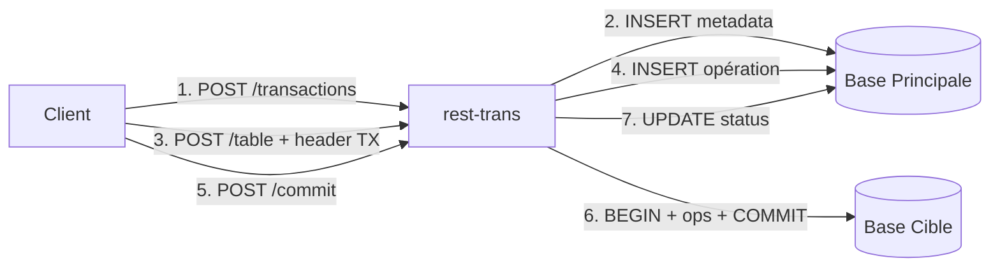
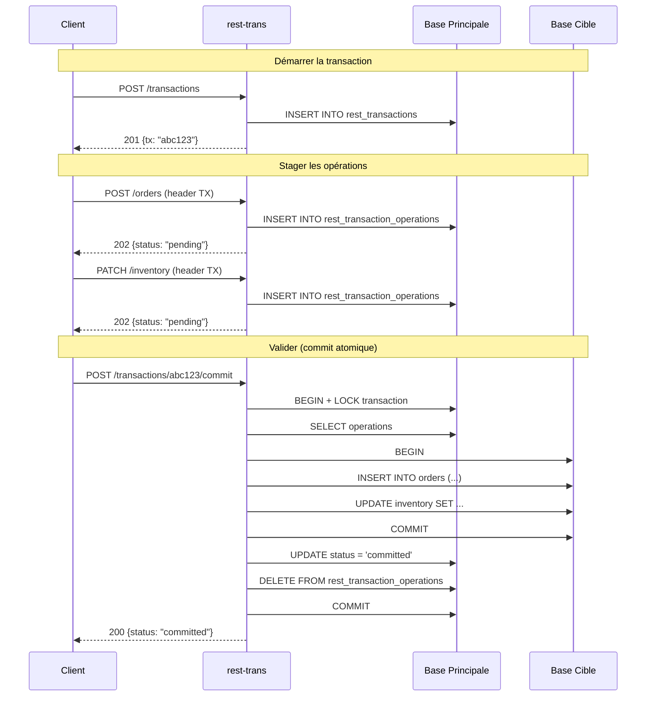
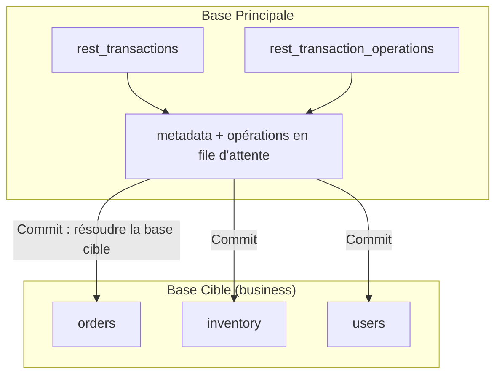
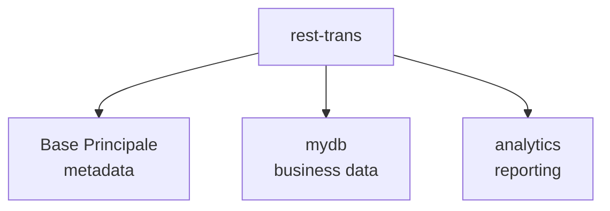
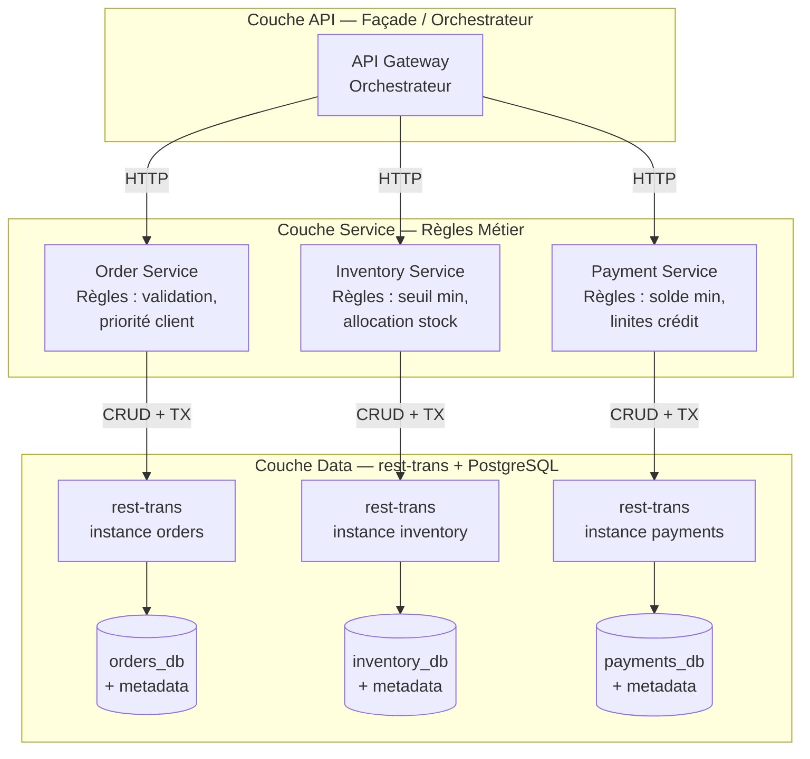
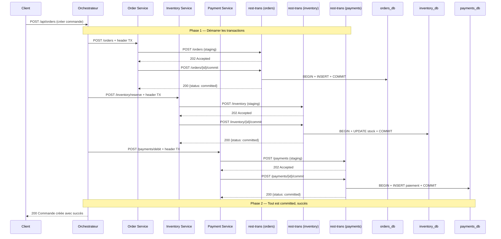
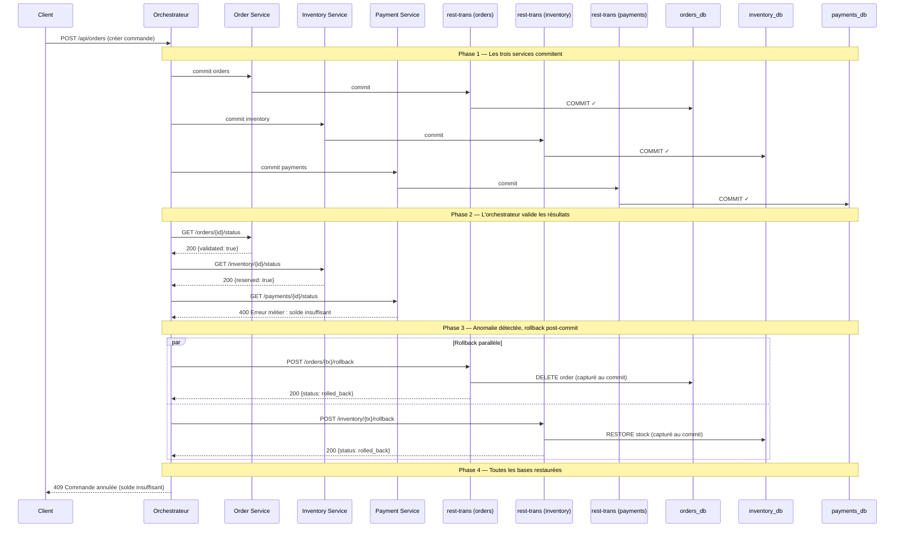
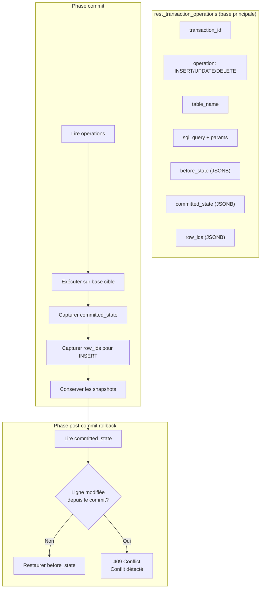

# Transactions

rest-trans supporte des transactions distribuées au niveau HTTP en utilisant le **pattern Saga**. Les métadonnées de transaction sont stockées dans la base de données principale, tandis que les opérations sont exécutées sur la base cible lors du commit. Cela permet les déploiements multi-bases et multi-instances.

## Vue d'ensemble

Le workflow de transaction suit un schéma simple :

1. **Démarrer** une transaction pour obtenir un ID de transaction
2. **Exécuter** des opérations CRUD en utilisant l'ID de transaction dans le header `Authorization-Transaction` (les opérations sont mises en file d'attente, pas exécutées immédiatement)
3. **Valider** (commit) pour exécuter toutes les opérations mises en file d'attente de manière atomique sur la base cationale, ou **Annuler** (rollback) pour les supprimer

Les transactions sont stockées dans des tables PostgreSQL (`rest_transactions` et `rest_transaction_operations`) dans la base principale, les rendant accessibles depuis n'importe quelle instance de rest-trans.



## Référence API

### Démarrer une transaction

```
POST /{schema}/transactions
```

Crée une nouvelle transaction et retourne un ID de transaction.

**Réponse :**
```json
{
  "tx": "a1b2c3d4-e5f6-7890-abcd-ef1234567890"
}
```

**Statut :** `201 Created`

### Lister les transactions ouvertes

```
GET /{schema}/transactions
```

Retourne toutes les transactions en attente pour le schéma spécifié.

**Réponse :**
```json
[
  {
    "id": "a1b2c3d4-e5f6-7890-abcd-ef1234567890",
    "schema": "public",
    "status": "pending",
    "operation_count": 3,
    "created_at": "2026-07-26T10:30:00Z"
  }
]
```

**Statut :** `200 OK`

### Obtenir le statut d'une transaction

```
GET /{schema}/transactions/{txID}
```

Retourne le statut et les métadonnées d'une transaction spécifique.

**Réponse :**
```json
{
  "id": "a1b2c3d4-e5f6-7890-abcd-ef1234567890",
  "schema": "public",
  "status": "pending",
  "operation_count": 3,
  "created_at": "2026-07-26T10:30:00Z"
}
```

**Statut :** `200 OK`

### Valider (commit) une transaction

```
POST /{schema}/transactions/{txID}/commit
```

Exécute toutes les opérations mises en file d'attente de manière atomique sur la base cible.

**Réponse :**
```json
{
  "status": "committed"
}
```

**Statut :** `200 OK`

### Annuler (rollback) une transaction

```
POST /{schema}/transactions/{txID}/rollback
```

Supprime toutes les opérations mises en file d'attente. Aucune modification n'est apportée à la base.

**Réponse :**
```json
{
  "status": "rolled_back"
}
```

**Statut :** `200 OK`

## Utilisation des transactions

### Flux de base

```bash
# 1. Démarrer une transaction
TX_ID=$(curl -s -X POST http://localhost:3000/public/transactions \
  -H "Content-Type: application/json" | jq -r '.tx')

# 2. Insérer un enregistrement (opération mise en file d'attente, pas exécutée)
curl -X POST http://localhost:3000/public/orders \
  -H "Authorization-Transaction: $TX_ID" \
  -H "Content-Type: application/json" \
  -d '{"product_id": 42, "quantity": 10, "status": "pending"}'
# Réponse : 202 Accepted {"status":"pending","tx":"a1b2c3d4..."}

# 3. Mettre à jour un autre enregistrement (aussi mis en file d'attente)
curl -X PATCH http://localhost:3000/public/inventory?product_id=eq.42 \
  -H "Authorization-Transaction: $TX_ID" \
  -H "Content-Type: application/json" \
  -d '{"stock": "stock - 10"}'
# Réponse : 202 Accepted {"status":"pending","tx":"a1b2c3d4..."}

# 4. Vérifier le statut de la transaction (affiche le nombre d'opérations)
curl http://localhost:3000/public/transactions/$TX_ID
# Réponse : {"id":"...","status":"pending","operation_count":2,...}

# 5. Valider toutes les opérations atomiquement
curl -X POST "http://localhost:3000/public/transactions/$TX_ID/commit"
# Réponse : 200 OK {"status":"committed"}
```

### Exemple de rollback

```bash
# Démarrer une transaction
TX_ID=$(curl -s -X POST http://localhost:3000/public/transactions | jq -r '.tx')

# Effectuer des opérations (mises en file d'attente)
curl -X POST http://localhost:3000/public/orders \
  -H "Authorization-Transaction: $TX_ID" \
  -H "Content-Type: application/json" \
  -d '{"product_id": 42, "quantity": 10}'

# Annuler — les opérations sont supprimées, rien n'est persisté
curl -X POST "http://localhost:3000/public/transactions/$TX_ID/rollback"
```

### Opérations supportées

Dans le cadre d'une transaction, vous pouvez utiliser les opérations CRUD suivantes avec le header `Authorization-Transaction` :

- **INSERT :** `POST /{schema}/{table}`
- **UPDATE :** `PUT/PATCH /{schema}/{table}`
- **DELETE :** `DELETE /{schema}/{table}`

**Note :** Les opérations `SELECT` ne sont pas affectées par les transactions et lisent toujours les données validées. Les opérations en file d'attente retournent `202 Accepted` au lieu de la réponse normale.

## Architecture

### Pattern Saga

Le **Saga Pattern** est un mécanisme de transaction distribuée qui décompose une opération complexe en une séquence d'étapes locales. Si une étape échoue, des **compensations** (annulations inversées) sont exécutées pour restaurer l'incohérence. Contrairement à une transaction ACID classique qui maintient un verrou sur toutes les ressources, Saga libère chaque verrou après chaque étape, au prix d'une gestion explicite des annulations.

Dans rest-trans, le choix est simplifié : les opérations sont **staging** (stockées en attente) sans être exécutées, puis exécutées en une seule transaction atomique lors du commit. Si le commit échoue, les opérations sont simplement supprimées — pas de compensation distribuée nécessaire car rien n'a été appliqué.

Au lieu de maintenir une vraie transaction PostgreSQL ouverte (liée à une seule connexion de base), rest-trans utilise le **pattern Saga** :

1. **Démarrer :** Créer un enregistrement de transaction dans `rest_transactions` (base principale)
2. **Exécuter :** Chaque opération CRUD est enregistrée dans `rest_transaction_operations` avec la requête SQL et les paramètres (base principale)
3. **Valider :**
   - Verrouiller la transaction dans la base principale
   - Ouvrir une vraie transaction de base sur la **base cible**
   - Exécuter toutes les opérations en file d'attente
   - Valider la transaction de la base cible
   - Mettre à jour le statut et nettoyer dans la base principale
4. **Annuler :** Simplement supprimer les opérations en file d'attente de la base principale (aucune modification de base)



### Séparation des bases de données



### Flux des requêtes

```mermaid
flowchart TD
    A[POST /public/transactions] --> B[TransactionHandler.Start]
    B --> C[INSERT INTO rest_transactions]
    C --> D[201 {"tx": "abc123"}]

    E[POST /public/orders\nheader: Authorization-Transaction: abc123] --> F[TransactionMiddleware]
    F --> G{txID valide et pending?}
    G -->|Non| H[409 Conflict]
    G -->|Oui| I[INSERT INTO rest_transaction_operations]
    I --> J[202 {"status": "pending", "tx": "abc123"}]

    K[POST /public/transactions/abc123/commit] --> L[TransactionHandler.Commit]
    L --> M[BEGIN sur base principale]
    M --> N[Lire les opérations]
    N --> O[Ouvrir transaction sur base cible]
    O --> P[Exécuter toutes les opérations]
    P --> Q[COMMIT sur base cible]
    Q --> R[UPDATE status = committed]
    R --> S[DELETE opérations]
    S --> T[COMMIT sur base principale]
    T --> U[200 {"status": "committed"}]
```

### Tables de base de données

```sql
-- Métadonnées de transaction (base principale)
CREATE TABLE rest_transactions (
    id VARCHAR(36) PRIMARY KEY,
    schema_name VARCHAR(255) NOT NULL,
    status VARCHAR(20) NOT NULL DEFAULT 'pending',
    created_at TIMESTAMPTZ NOT NULL DEFAULT NOW(),
    updated_at TIMESTAMPTZ NOT NULL DEFAULT NOW()
);

-- Opérations en file d'attente (base principale)
CREATE TABLE rest_transaction_operations (
    id SERIAL PRIMARY KEY,
    transaction_id VARCHAR(36) NOT NULL REFERENCES rest_transactions(id) ON DELETE CASCADE,
    operation VARCHAR(10) NOT NULL,
    table_name TEXT NOT NULL,
    sql_query TEXT NOT NULL,
    params JSONB,
    created_at TIMESTAMPTZ NOT NULL DEFAULT NOW()
);
```

### Nettoyage

Un goroutine en arrière-plan s'exécute toutes les 60 secondes et supprime les transactions expirées (TTL par défaut : 30 minutes). Les transactions expirées et leurs opérations en file d'attente sont automatiquement supprimées de la base principale.

## Configuration

### TTL de transaction

Le TTL est configuré dans `config.yaml` :

```yaml
transactions:
  enabled: true
  ttl: 30m
  cleanup_interval: 60s
```

### Pool de connexions

- **Base principale :** Utilisée pour les métadonnées de transaction et les opérations en file d'attente
- **Bases cibles :** Résolues via le registre d'adaptateurs lors du commit

## Déploiement multi-bases de données

Avec cette architecture, vous pouvez servir plusieurs bases de données depuis une seule instance de rest-trans. Pour un scénario complet avec orchestration distribuée et post-commit rollback, voir la section [Post-commit Rollback](#post-commit-rollback--rollback-distribué-multi-bases).



- Les métadonnées de transaction vivent toujours dans la base principale
- Les opérations sont exécutées sur la base spécifiée dans la transaction
- Chaque base doit être configurée et accessible

## Post-commit Rollback : rollback distribué multi-bases

### Scénario d'usage

Dans une architecture microservices, une opération métier complexe peut impliquer plusieurs bases de données. Par exemple, une commande client peut nécessiter :

1. **Order Service** : créer la commande dans la base `orders_db`
2. **Inventory Service** : réserver le stock dans la base `inventory_db`
3. **Payment Service** : débiter le compte dans la base `payments_db`

Chaque service utilise sa propre instance de rest-trans connectée à sa base. Un **orchestrateur** (façade API) coordonne les transactions. Si une étape échoue **après le commit**, l'orchestrateur peut déclencher un **post-commit rollback** sur les autres bases.

### Architecture distribuée



Chaque instance de rest-trans possède sa **base principale** (tables `rest_transactions` / `rest_transaction_operations`) dans la même base que les données métier. Cela permet de gérer les métadonnées de transaction localement tout en servant les données de chaque service.

### Flux — commit réussi (happy path)



### Flux — post-commit rollback (anomalie détectée)



### Mécanisme interne du post-commit rollback

Le rollback post-commit repose sur trois mécanismes dans rest-trans :

#### 1. Capture des snapshots au commit

Lors du `commit`, rest-trans capture automatiquement :
- **`before_state`** : l'état de la ligne **avant** l'opération (pour UPDATE/DELETE)
- **`committed_state`** : l'état de la ligne **après** le commit (pour UPDATE/INSERT)
- **`row_ids`** : les identifiants des lignes affectées (pour INSERT)

Ces snapshots sont stockés dans `rest_transaction_operations` et conservés après le commit.

#### 2. Détection de conflits

Avant d'appliquer un rollback, rest-trans compare l'état **actuel** de la ligne en base avec le `committed_state` :
- Si la ligne n'a **pas changé** depuis le commit → rollback applicable
- Si la ligne a **changé** (conflit) → rollback refusé (409 Conflict)

#### 3. Restauration par type d'opération

| Type | Mécanisme de restauration |
|------|--------------------------|
| **INSERT** | `DELETE FROM table WHERE id = <captured_id>` |
| **UPDATE** | `UPDATE table SET <before_state> WHERE id = <id>` |
| **DELETE** | `INSERT INTO table (<before_state>)` |

#### Schéma de la capture



### Cas d'usage concrets

| Scénario | Déclencheur | Action |
|----------|-------------|--------|
| Commande refusée après paiement validé | Service paiement retourne erreur métier | Rollback order + inventory |
| Stock insuffisant après réservation | Service inventory détecte rupture | Rollback order + payment |
| Utilisateur banni après création de compte | Vérification fraud retardée | Rollback toutes les bases |
| Double paiement détecté | Réconciliation asynchrone | Rollback payment |

### Limitations

1. **Rollback non atomique** : Les rollbacks sur plusieurs bases sont exécutés en parallèle, pas dans une seule transaction distribuée.
2. **Fenêtre de vulnérabilité** : Entre le commit et le rollback, d'autres transactions peuvent modifier les données (conflits).
3. **Pas de rollback automatique** : L'orchestrateur doit explicitement appeler `/rollback` sur chaque transaction. rest-trans ne déclenche pas de rollback automatique.
4. **Base principale requise** : Les snapshots sont stockés dans la base principale. Si celle-ci est indisponible, le rollback est impossible.

## Limitations

1. **Exécution différée :** Les opérations ne sont pas exécutées avant le commit. Les requêtes SELECT ne verront pas les modifications en cours.

2. **Exécution dans l'ordre :** Les opérations sont exécutées dans l'ordre d'ajout. Si une opération ultérieure échoue, les opérations précédentes sont déjà validées (pas d'annulation individuelle automatique).

3. **Pas d'isolation :** Les transactions concurrentes peuvent s'interférer. Il n'y a pas de verrouillage pessimiste ou optimiste.

4. **Pression sur le pool de connexions :** Le commit exécute toutes les opérations dans une seule transaction, ce qui maintient une connexion pendant toute la durée.

5. **Pas de transactions imbriquées :** Tenter de démarrer une nouvelle transaction dans une existante n'est pas supporté.

6. **Base principale requise :** Les métadonnées de transaction sont toujours stockées dans la base principale. La base principale doit être accessible et avoir les tables de transaction créées.

## Gestion des erreurs

| Scénario | Statut HTTP | Message d'erreur |
|----------|-------------|------------------|
| Transaction non trouvée | `404 Not Found` | `Transaction not found: <txID>` |
| Transaction non pending | `409 Conflict` | `Transaction not found or not pending` |
| Échec du commit | `409 Conflict` | `Failed to commit transaction: <details>` |
| Échec du rollback | `409 Conflict` | `Failed to rollback transaction: <details>` |
| En-tête TX invalide | `409 Conflict` | `Transaction not found or not pending` |
| Corps de requête invalide | `400 Bad Request` | `Invalid JSON body` |
